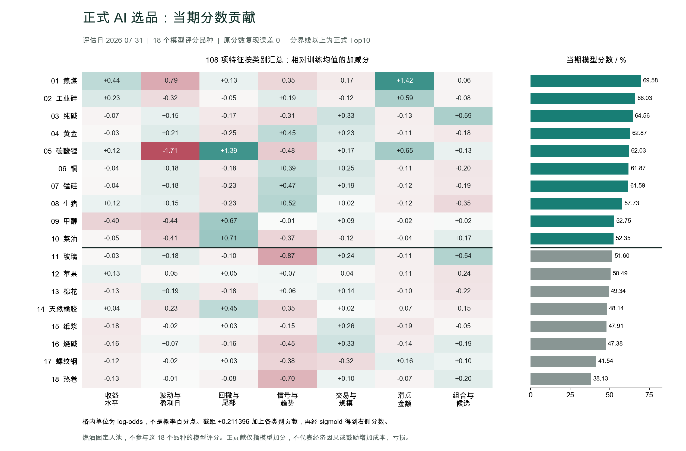
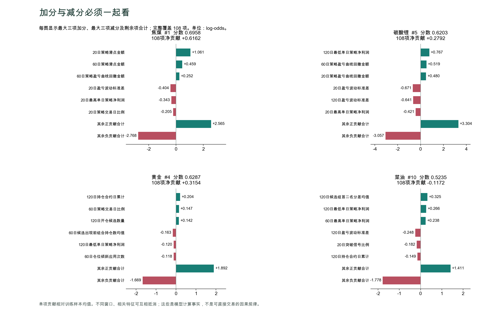

# 正式 AI 选品：2026-07-31 当期分数逐项解释

## 核对结论

原始 18 个品种及正式 Top10 的概率复现误差均为 **0**，18 个模型排名与 Top10 入选顺序完全一致。正式物料为 `m0004_20260831T112631+0800_2485073e9594`，训练输入两份 SHA256 与 2026-08-03 原始记录完全一致。

当期模型实际为 **108 个特征**，纠正前次机制说明中的 111 个。训练样本 1,368 行、76 个月；训练评估月末范围 2020-01-23 至 2026-04-30，60交易日标签截止门为 2026-05-07，数据源终点为 2026-08-03。此次仅按原参数重建模型做解释，没有策略回测、模型调参、生产文件写入或订单 API。

## 如何读贡献

`单项贡献 = 系数 × (当期特征值 - 训练均值) / 训练标准差`。标准化均值为原 StandardScaler 使用的非加权训练均值；分类器仍使用原样本权重。

`logit = 0.211396279339 + 108项贡献之和`；`概率 = 1 / (1 + exp(-logit))`。训练均值对应基准概率 55.265313%。

贡献单位是 **log-odds**，不是概率百分点。正值为模型加分，负值为模型减分；逐项相加是精确的，但不能把每一项解释成经济因果。基准不是当月横截面均值，排名差异请看后面的两品种差值。

## 当前全排名

| 模型排名 | 品种 | 分数 | 正式资格 | 最大两项加分 | 最大两项减分 |
| --- | --- | --- | --- | --- | --- |
| 1 | 焦煤 jm.DCE | 0.695849 | Top10入池 | 20日策略滑点金额 +1.061；60日策略滑点金额 +0.459 | 20日盈亏波动标准差 -0.404；20日最高单日策略净利润 -0.343 |
| 2 | 工业硅 si.GFEX | 0.660340 | Top10入池 | 20日策略滑点金额 +0.483；120日候选组首二名分差均值 +0.128 | 20日盈亏波动标准差 -0.212；20日最高单日策略净利润 -0.197 |
| 3 | 纯碱 SA.CZCE | 0.645589 | Top10入池 | 120日同方向最大相关性均值 +0.361；120日持仓合约日累计 +0.162 | 60日筛选后候选手数累计 -0.246；20日突破信号比例 -0.182 |
| 4 | 黄金 au.SHFE | 0.628731 | Top10入池 | 120日持仓合约日累计 +0.204；60日策略交易日比例 +0.147 | 60日候选出现前组合持仓数均值 -0.163；120日最低单日策略净利润 -0.120 |
| 5 | 碳酸锂 lc.GFEX | 0.620252 | Top10入池 | 120日最低单日策略净利润 +0.767；60日策略盈亏曲线回撤金额 +0.519 | 20日盈亏波动标准差 -0.671；120日盈亏波动标准差 -0.641 |
| 6 | 铜 cu.SHFE | 0.618670 | Top10入池 | 120日持仓合约日累计 +0.162；60日策略交易日比例 +0.147 | 60日仓位倾斜应用次数 -0.118；120日候选组首二名分差均值 -0.111 |
| 7 | 锰硅 SM.CZCE | 0.615907 | Top10入池 | 60日策略交易日比例 +0.147；120日仓位倾斜应用次数 +0.142 | 60日候选出现前组合持仓数均值 -0.163；60日仓位倾斜应用次数 -0.118 |
| 8 | 生猪 lh.DCE | 0.577337 | Top10入池 | 60日策略交易日比例 +0.147；120日仓位倾斜应用次数 +0.142 | 120日同方向最大相关性均值 -0.192；60日候选出现前组合持仓数均值 -0.163 |
| 9 | 甲醇 MA.CZCE | 0.527458 | Top10入池 | 120日最低单日策略净利润 +0.605；60日策略盈亏曲线回撤金额 +0.386 | 120日策略盈亏曲线回撤金额 -0.377；120日盈亏波动标准差 -0.374 |
| 10 | 菜油 OI.CZCE | 0.523530 | Top10入池 | 120日候选组首二名分差均值 +0.325；120日最低单日策略净利润 +0.266 | 120日盈亏波动标准差 -0.248；20日突破信号比例 -0.182 |
| 11 | 玻璃 FG.CZCE | 0.515984 | 未入池 | 120日同方向最大相关性均值 +0.332；60日过滤前候选手数累计 +0.263 | 60日筛选后候选手数累计 -0.426；120日空头排列比例 -0.305 |
| 12 | 苹果 AP.CZCE | 0.504880 | 未入池 | 120日最低单日策略净利润 +0.229；60日同方向持仓数均值 +0.124 | 120日同方向最大相关性均值 -0.213；120日盈亏波动标准差 -0.188 |
| 13 | 棉花 CF.CZCE | 0.493367 | 未入池 | 120日仓位倾斜应用次数 +0.142；60日策略类Sharpe指标 +0.107 | 60日仓位倾斜应用次数 -0.118；120日候选组首二名分差均值 -0.111 |
| 14 | 天然橡胶 ru.SHFE | 0.481431 | 未入池 | 120日候选组首二名分差均值 +0.289；60日策略盈亏曲线回撤金额 +0.196 | 120日仓位倾斜应用次数 -0.319；120日盈亏波动标准差 -0.253 |
| 15 | 纸浆 sp.SHFE | 0.479057 | 未入池 | 120日最低单日策略净利润 +0.256；60日策略交易日比例 +0.147 | 120日空头排列比例 -0.151；60日仓位倾斜应用次数 -0.118 |
| 16 | 烧碱 SH.CZCE | 0.473822 | 未入池 | 120日候选出现前组合持仓数均值 +0.260；60日策略交易日比例 +0.147 | 120日空头排列比例 -0.253；60日仓位倾斜应用次数 -0.118 |
| 17 | 螺纹钢 rb.SHFE | 0.415390 | 未入池 | 120日同方向最大相关性均值 +0.309；120日候选组首二名分差均值 +0.193 | 120日仓位倾斜应用次数 -0.319；60日仓位变化绝对量累计 -0.203 |
| 18 | 热卷 hc.SHFE | 0.381339 | 未入池 | 120日候选组首二名分差均值 +0.230；120日同方向最大相关性均值 +0.212 | 120日仓位倾斜应用次数 -0.319；20日突破信号比例 -0.182 |

燃油 `fu.SHFE` 固定进入正式池第11位，不在这次18个模型评分品种中。其发布分数是第10名分数减 `0.000001`，不是真实模型预测，不能做模型贡献拆解。玻璃的模型第11名与燃油的正式席位第11位是两种不同编号。

## 关键发现与解释边界

1. 焦煤和工业硅的主要加分项包含近期策略滑点金额。焦煤20日滑点为4,200，训练均值252.124，标准化值6.277，系数+0.168992，单项贡献+1.060794；工业硅同项+0.483089。这里是回放的滑点总金额，可能同时代理交易规模、频率及波动机会，不能解释成增加真实交易成本会改善策略。
2. 碳酸锂有明显的正负抵消：120日最低单日净利润-200,520贡献+0.766657，60日回撤金额-225,270贡献+0.518886，20日回撤贡献+0.480349；20日和120日盈亏波动分别贡献-0.670828、-0.640915。深亏加分只是当前拟合系数的计算结果，不能当成逆势加仓规则。
3. 黄金近120日基础策略持仓合约日累计为0，这项贡献+0.204490；60日交易日比例0贡献+0.146687，120日开仓候选数量0贡献+0.141981。其排名高不等于这段时间策略已在黄金上赚很多钱；无持仓或无信号的零值特征也可能被模型加分。
4. 菜油和玻璃靠近入池边界。不是菜油所有指标都更好，而是正负差项抵消后微幅领先。详情见下一节。
5. 同一指标不同窗口可有相反系数，例如20/60日回撤系数为负而120日为正；仓位倾斜次数60日为正、120日为负。相关或重复特征的单项系数不能脱离其他项解读。
6. 候选统计是基础策略在有信号日记录并按交易日补齐的数据；无信号日多数填0，相关性过滤权重、仓位倾斜倍率使用中性1。候选组首二名分差是当时同方向候选组前两名的分差，并非该品种独有优势。

## 排名差异：菜油为什么略高于玻璃

菜油 0.523530，玻璃 0.515984，相差 **0.7546 个概率百分点**；108项差值合计 **+0.030231 log-odds**。

| 因素 | 菜油减玻璃的贡献差 | 模型方向 |
| --- | --- | --- |
| 120日候选组首二名分差均值 | +0.436283 | 菜油相对占优 |
| 60日筛选后候选手数累计 | +0.408730 | 菜油相对占优 |
| 120日最低单日策略净利润 | +0.385089 | 菜油相对占优 |
| 120日空头排列比例 | +0.358044 | 菜油相对占优 |
| 60日策略盈亏曲线回撤金额 | +0.292487 | 菜油相对占优 |
| 120日盈亏波动标准差 | -0.372533 | 玻璃相对占优 |
| 120日持仓合约日累计 | -0.339254 | 玻璃相对占优 |
| 120日同方向最大相关性均值 | -0.312810 | 玻璃相对占优 |
| 60日过滤前候选手数累计 | -0.253789 | 玻璃相对占优 |
| 60日策略交易日比例 | -0.242765 | 玻璃相对占优 |
| 其余98项合计 | -0.329251 | 未省略净贡献 |

这说明边界名次由多个大幅相反贡献抵消后形成；此处没有做扰动实验，不据此声称排名不稳定或具有统计显著性。

## 各品种逐项解释

### 1. 焦煤 jm.DCE

分数 `0.695848894`；正贡献总和 `+4.336062`，负贡献总和 `-3.719851`，净贡献 `+0.616212`。

| 因素 | 原值 | 训练均值 | 标准化值 | 系数 | 贡献log-odds |
| --- | --- | --- | --- | --- | --- |
| 20日策略滑点金额 | 4200 | 252.124 | +6.2772 | +0.168992 | +1.060794 |
| 60日策略滑点金额 | 6000 | 739.704 | +4.4808 | +0.102380 | +0.458742 |
| 60日策略盈亏曲线回撤金额 | -122130 | -24926.3 | -2.7912 | -0.090197 | +0.251756 |
| 20日日均策略净利润 | 4021.5 | 100.892 | +2.5496 | +0.072019 | +0.183623 |
| 20日累计策略净利润 | 80430 | 2018.95 | +2.5497 | +0.071142 | +0.181390 |
| 20日盈亏波动标准差 | 20094.2 | 2921.92 | +2.6324 | -0.153532 | -0.404163 |
| 20日最高单日策略净利润 | 77280 | 6293.47 | +4.1073 | -0.083407 | -0.342575 |
| 20日策略交易日比例 | 0.15 | 0.0403966 | +2.0620 | -0.099461 | -0.205091 |
| 120日盈亏波动标准差 | 11723.4 | 4702.75 | +1.3741 | -0.135610 | -0.186339 |
| 60日策略交易日比例 | 0.0833333 | 0.0402823 | +1.2551 | -0.124904 | -0.156769 |
| 其余正贡献合计 |  |  |  |  | +2.199759 |
| 其余负贡献合计 |  |  |  |  | -2.424913 |

### 2. 工业硅 si.GFEX

分数 `0.660340195`；正贡献总和 `+2.361071`，负贡献总和 `-1.907657`，净贡献 `+0.453414`。

| 因素 | 原值 | 训练均值 | 标准化值 | 系数 | 贡献log-odds |
| --- | --- | --- | --- | --- | --- |
| 20日策略滑点金额 | 2050 | 252.124 | +2.8586 | +0.168992 | +0.483089 |
| 120日候选组首二名分差均值 | 0.00624896 | 0.00290573 | +0.7969 | +0.160193 | +0.127664 |
| 60日策略滑点金额 | 2125 | 739.704 | +1.1800 | +0.102380 | +0.120809 |
| 120日同方向最大相关性均值 | 0.0119845 | 0.00746293 | +0.6467 | +0.180021 | +0.116411 |
| 20日筛选后候选手数累计 | 82 | 13.8143 | +2.2471 | +0.045509 | +0.102260 |
| 20日盈亏波动标准差 | 11925.2 | 2921.92 | +1.3802 | -0.153532 | -0.211899 |
| 20日最高单日策略净利润 | 47150 | 6293.47 | +2.3640 | -0.083407 | -0.197170 |
| 20日仓位变化绝对量累计 | 82 | 12.4518 | +2.1849 | -0.076498 | -0.167142 |
| 60日候选出现前组合持仓数均值 | 0.0166667 | 0.0841632 | -0.9931 | +0.131607 | -0.130703 |
| 60日仓位倾斜应用次数 | 0 | 0.325292 | -0.5708 | +0.206915 | -0.118113 |
| 其余正贡献合计 |  |  |  |  | +1.410837 |
| 其余负贡献合计 |  |  |  |  | -1.082629 |

### 3. 纯碱 SA.CZCE

分数 `0.645588723`；正贡献总和 `+2.473493`，负贡献总和 `-2.085184`，净贡献 `+0.388308`。

| 因素 | 原值 | 训练均值 | 标准化值 | 系数 | 贡献log-odds |
| --- | --- | --- | --- | --- | --- |
| 120日同方向最大相关性均值 | 0.0214915 | 0.00746293 | +2.0063 | +0.180021 | +0.361174 |
| 120日持仓合约日累计 | 3 | 14.4664 | -0.9862 | -0.164346 | +0.162084 |
| 60日过滤前候选手数累计 | 218 | 43.5146 | +2.8447 | +0.052948 | +0.150620 |
| 60日策略交易日比例 | 0 | 0.0402823 | -1.1744 | -0.124904 | +0.146687 |
| 120日候选组首二名分差均值 | 0.00587948 | 0.00290573 | +0.7089 | +0.160193 | +0.113555 |
| 60日筛选后候选手数累计 | 218 | 41.3933 | +3.0377 | -0.080827 | -0.245525 |
| 20日突破信号比例 | 0.05 | 0.0119335 | +1.6674 | -0.108983 | -0.181719 |
| 60日仓位倾斜应用次数 | 0 | 0.325292 | -0.5708 | +0.206915 | -0.118113 |
| 120日空头排列比例 | 0.0333333 | 0.0170561 | +1.1545 | -0.086538 | -0.099908 |
| 120日仓位倾斜应用次数 | 1 | 0.616228 | +0.4970 | -0.177733 | -0.088342 |
| 其余正贡献合计 |  |  |  |  | +1.539373 |
| 其余负贡献合计 |  |  |  |  | -1.351577 |

### 4. 黄金 au.SHFE

分数 `0.628731107`；正贡献总和 `+2.384880`，负贡献总和 `-2.069499`，净贡献 `+0.315381`。

| 因素 | 原值 | 训练均值 | 标准化值 | 系数 | 贡献log-odds |
| --- | --- | --- | --- | --- | --- |
| 120日持仓合约日累计 | 0 | 14.4664 | -1.2443 | -0.164346 | +0.204490 |
| 60日策略交易日比例 | 0 | 0.0402823 | -1.1744 | -0.124904 | +0.146687 |
| 120日开仓候选数量 | 0 | 2.22807 | -1.4270 | -0.099494 | +0.141981 |
| 120日仓位倾斜应用次数 | 0 | 0.616228 | -0.7981 | -0.177733 | +0.141852 |
| 120日盈亏波动标准差 | 0 | 4702.75 | -0.9204 | -0.135610 | +0.124819 |
| 60日候选出现前组合持仓数均值 | 0 | 0.0841632 | -1.2384 | +0.131607 | -0.162977 |
| 120日最低单日策略净利润 | 0 | -27056.8 | +0.9007 | -0.132766 | -0.119583 |
| 60日仓位倾斜应用次数 | 0 | 0.325292 | -0.5708 | +0.206915 | -0.118113 |
| 120日候选组首二名分差均值 | 0 | 0.00290573 | -0.6926 | +0.160193 | -0.110957 |
| 20日候选出现前组合持仓数均值 | 0 | 0.0849598 | -0.7579 | +0.140325 | -0.106359 |
| 其余正贡献合计 |  |  |  |  | +1.625051 |
| 其余负贡献合计 |  |  |  |  | -1.451510 |

### 5. 碳酸锂 lc.GFEX

分数 `0.620251825`；正贡献总和 `+5.069753`，负贡献总和 `-4.790532`，净贡献 `+0.279221`。

| 因素 | 原值 | 训练均值 | 标准化值 | 系数 | 贡献log-odds |
| --- | --- | --- | --- | --- | --- |
| 120日最低单日策略净利润 | -200520 | -27056.8 | -5.7745 | -0.132766 | +0.766657 |
| 60日策略盈亏曲线回撤金额 | -225270 | -24926.3 | -5.7528 | -0.090197 | +0.518886 |
| 20日策略盈亏曲线回撤金额 | -84750 | -9438.04 | -3.5045 | -0.137066 | +0.480349 |
| 60日最高单日策略净利润 | 162720 | 15112.3 | +5.6447 | +0.075047 | +0.423613 |
| 60日策略滑点金额 | 5100 | 739.704 | +3.7142 | +0.102380 | +0.380254 |
| 20日盈亏波动标准差 | 31424.3 | 2921.92 | +4.3693 | -0.153532 | -0.670828 |
| 120日盈亏波动标准差 | 28850.3 | 4702.75 | +4.7262 | -0.135610 | -0.640915 |
| 20日最高单日策略净利润 | 93600 | 6293.47 | +5.0516 | -0.083407 | -0.421334 |
| 60日盈亏波动标准差 | 38101 | 4108.36 | +5.9519 | -0.062716 | -0.373276 |
| 120日策略盈亏曲线回撤金额 | -225270 | -41795.4 | -4.0274 | +0.087431 | -0.352119 |
| 其余正贡献合计 |  |  |  |  | +2.499994 |
| 其余负贡献合计 |  |  |  |  | -2.332061 |

### 6. 铜 cu.SHFE

分数 `0.618669608`；正贡献总和 `+2.014659`，负贡献总和 `-1.742150`，净贡献 `+0.272509`。

| 因素 | 原值 | 训练均值 | 标准化值 | 系数 | 贡献log-odds |
| --- | --- | --- | --- | --- | --- |
| 120日持仓合约日累计 | 3 | 14.4664 | -0.9862 | -0.164346 | +0.162084 |
| 60日策略交易日比例 | 0 | 0.0402823 | -1.1744 | -0.124904 | +0.146687 |
| 120日仓位倾斜应用次数 | 0 | 0.616228 | -0.7981 | -0.177733 | +0.141852 |
| 120日盈亏波动标准差 | 412.778 | 4702.75 | -0.8396 | -0.135610 | +0.113863 |
| 60日日内最佳候选名次均值 | 0 | 0.0252053 | -1.0092 | -0.103366 | +0.104313 |
| 60日仓位倾斜应用次数 | 0 | 0.325292 | -0.5708 | +0.206915 | -0.118113 |
| 120日候选组首二名分差均值 | 0 | 0.00290573 | -0.6926 | +0.160193 | -0.110957 |
| 20日候选出现前组合持仓数均值 | 0 | 0.0849598 | -0.7579 | +0.140325 | -0.106359 |
| 120日最低单日策略净利润 | -3200 | -27056.8 | +0.7942 | -0.132766 | -0.105440 |
| 20日策略滑点金额 | 0 | 252.124 | -0.4009 | +0.168992 | -0.067746 |
| 其余正贡献合计 |  |  |  |  | +1.345859 |
| 其余负贡献合计 |  |  |  |  | -1.233535 |

### 7. 锰硅 SM.CZCE

分数 `0.615906616`；正贡献总和 `+2.197603`，负贡献总和 `-1.936789`，净贡献 `+0.260813`。

| 因素 | 原值 | 训练均值 | 标准化值 | 系数 | 贡献log-odds |
| --- | --- | --- | --- | --- | --- |
| 60日策略交易日比例 | 0 | 0.0402823 | -1.1744 | -0.124904 | +0.146687 |
| 120日仓位倾斜应用次数 | 0 | 0.616228 | -0.7981 | -0.177733 | +0.141852 |
| 60日候选信号日比例 | 0 | 0.035874 | -1.7422 | -0.074358 | +0.129543 |
| 60日同方向持仓数均值 | 0 | 0.050015 | -0.9588 | -0.128984 | +0.123670 |
| 120日持仓合约日累计 | 7 | 14.4664 | -0.6422 | -0.164346 | +0.105541 |
| 60日候选出现前组合持仓数均值 | 0 | 0.0841632 | -1.2384 | +0.131607 | -0.162977 |
| 60日仓位倾斜应用次数 | 0 | 0.325292 | -0.5708 | +0.206915 | -0.118113 |
| 120日候选组首二名分差均值 | 0 | 0.00290573 | -0.6926 | +0.160193 | -0.110957 |
| 20日候选出现前组合持仓数均值 | 0 | 0.0849598 | -0.7579 | +0.140325 | -0.106359 |
| 120日最低单日策略净利润 | -8400 | -27056.8 | +0.6211 | -0.132766 | -0.082457 |
| 其余正贡献合计 |  |  |  |  | +1.550308 |
| 其余负贡献合计 |  |  |  |  | -1.355926 |

### 8. 生猪 lh.DCE

分数 `0.577337464`；正贡献总和 `+2.422698`，负贡献总和 `-2.322241`，净贡献 `+0.100457`。

| 因素 | 原值 | 训练均值 | 标准化值 | 系数 | 贡献log-odds |
| --- | --- | --- | --- | --- | --- |
| 60日策略交易日比例 | 0 | 0.0402823 | -1.1744 | -0.124904 | +0.146687 |
| 120日仓位倾斜应用次数 | 0 | 0.616228 | -0.7981 | -0.177733 | +0.141852 |
| 120日同方向持仓数均值 | 0 | 0.0485052 | -1.2873 | -0.109447 | +0.140891 |
| 60日候选信号日比例 | 0 | 0.035874 | -1.7422 | -0.074358 | +0.129543 |
| 60日同方向持仓数均值 | 0 | 0.050015 | -0.9588 | -0.128984 | +0.123670 |
| 120日同方向最大相关性均值 | 0 | 0.00746293 | -1.0673 | +0.180021 | -0.192137 |
| 60日候选出现前组合持仓数均值 | 0 | 0.0841632 | -1.2384 | +0.131607 | -0.162977 |
| 120日候选出现前组合持仓数均值 | 0.0333333 | 0.0812458 | -0.9338 | +0.130453 | -0.121811 |
| 60日仓位倾斜应用次数 | 0 | 0.325292 | -0.5708 | +0.206915 | -0.118113 |
| 120日候选组首二名分差均值 | 0 | 0.00290573 | -0.6926 | +0.160193 | -0.110957 |
| 其余正贡献合计 |  |  |  |  | +1.740053 |
| 其余负贡献合计 |  |  |  |  | -1.616246 |

### 9. 甲醇 MA.CZCE

分数 `0.527458176`；正贡献总和 `+2.941589`，负贡献总和 `-3.043042`，净贡献 `-0.101453`。

| 因素 | 原值 | 训练均值 | 标准化值 | 系数 | 贡献log-odds |
| --- | --- | --- | --- | --- | --- |
| 120日最低单日策略净利润 | -163880 | -27056.8 | -4.5548 | -0.132766 | +0.604719 |
| 60日策略盈亏曲线回撤金额 | -174080 | -24926.3 | -4.2829 | -0.090197 | +0.386305 |
| 120日候选组首二名分差均值 | 0.0114253 | 0.00290573 | +2.0308 | +0.160193 | +0.325326 |
| 60日同方向持仓数均值 | 0 | 0.050015 | -0.9588 | -0.128984 | +0.123670 |
| 60日策略类Sharpe指标 | -0.827026 | -0.0776516 | -0.9184 | -0.091965 | +0.084465 |
| 120日策略盈亏曲线回撤金额 | -238360 | -41795.4 | -4.3148 | +0.087431 | -0.377241 |
| 120日盈亏波动标准差 | 18783.3 | 4702.75 | +2.7558 | -0.135610 | -0.373721 |
| 60日仓位变化绝对量累计 | 136 | 36.4605 | +1.6562 | -0.120397 | -0.199407 |
| 60日盈亏波动标准差 | 21760.5 | 4108.36 | +3.0908 | -0.062716 | -0.193839 |
| 60日候选出现前组合持仓数均值 | 0 | 0.0841632 | -1.2384 | +0.131607 | -0.162977 |
| 其余正贡献合计 |  |  |  |  | +1.417104 |
| 其余负贡献合计 |  |  |  |  | -1.735857 |

### 10. 菜油 OI.CZCE

分数 `0.523530040`；正贡献总和 `+2.239808`，负贡献总和 `-2.357015`，净贡献 `-0.117207`。

| 因素 | 原值 | 训练均值 | 标准化值 | 系数 | 贡献log-odds |
| --- | --- | --- | --- | --- | --- |
| 120日候选组首二名分差均值 | 0.0114253 | 0.00290573 | +2.0308 | +0.160193 | +0.325326 |
| 120日最低单日策略净利润 | -87210 | -27056.8 | -2.0025 | -0.132766 | +0.265860 |
| 60日最高单日策略净利润 | 98010 | 15112.3 | +3.1701 | +0.075047 | +0.237905 |
| 60日策略盈亏曲线回撤金额 | -112930 | -24926.3 | -2.5270 | -0.090197 | +0.227928 |
| 60日策略成交额 | 6.39313e+06 | 2.27534e+06 | +1.4351 | +0.058038 | +0.083294 |
| 120日盈亏波动标准差 | 14046.1 | 4702.75 | +1.8287 | -0.135610 | -0.247987 |
| 20日突破信号比例 | 0.05 | 0.0119335 | +1.6674 | -0.108983 | -0.181719 |
| 120日持仓合约日累计 | 25 | 14.4664 | +0.9060 | -0.164346 | -0.148899 |
| 60日盈亏波动标准差 | 17361 | 4108.36 | +2.3204 | -0.062716 | -0.145529 |
| 120日策略盈亏曲线回撤金额 | -112930 | -41795.4 | -1.5615 | +0.087431 | -0.136520 |
| 其余正贡献合计 |  |  |  |  | +1.099497 |
| 其余负贡献合计 |  |  |  |  | -1.496362 |

### 11. 玻璃 FG.CZCE

分数 `0.515984127`；正贡献总和 `+3.158732`，负贡献总和 `-3.306170`，净贡献 `-0.147438`。

| 因素 | 原值 | 训练均值 | 标准化值 | 系数 | 贡献log-odds |
| --- | --- | --- | --- | --- | --- |
| 120日同方向最大相关性均值 | 0.0203504 | 0.00746293 | +1.8431 | +0.180021 | +0.331795 |
| 60日过滤前候选手数累计 | 348 | 43.5146 | +4.9641 | +0.052948 | +0.262840 |
| 120日候选出现前组合持仓数均值 | 0.175 | 0.0812458 | +1.8271 | +0.130453 | +0.238357 |
| 120日持仓合约日累计 | 1 | 14.4664 | -1.1583 | -0.164346 | +0.190355 |
| 60日策略交易日比例 | 0 | 0.0402823 | -1.1744 | -0.124904 | +0.146687 |
| 60日筛选后候选手数累计 | 348 | 41.3933 | +5.2737 | -0.080827 | -0.426256 |
| 120日空头排列比例 | 0.0666667 | 0.0170561 | +3.5187 | -0.086538 | -0.304505 |
| 20日突破信号比例 | 0.05 | 0.0119335 | +1.6674 | -0.108983 | -0.181719 |
| 60日候选信号日比例 | 0.0833333 | 0.035874 | +2.3048 | -0.074358 | -0.171378 |
| 120日同方向持仓数均值 | 0.1 | 0.0485052 | +1.3666 | -0.109447 | -0.149575 |
| 其余正贡献合计 |  |  |  |  | +1.988698 |
| 其余负贡献合计 |  |  |  |  | -2.072737 |

### 12. 苹果 AP.CZCE

分数 `0.504879823`；正贡献总和 `+1.864687`，负贡献总和 `-2.056563`，净贡献 `-0.191876`。

| 因素 | 原值 | 训练均值 | 标准化值 | 系数 | 贡献log-odds |
| --- | --- | --- | --- | --- | --- |
| 120日最低单日策略净利润 | -78840 | -27056.8 | -1.7238 | -0.132766 | +0.228867 |
| 60日同方向持仓数均值 | 0 | 0.050015 | -0.9588 | -0.128984 | +0.123670 |
| 120日同方向持仓数均值 | 0.00833333 | 0.0485052 | -1.0661 | -0.109447 | +0.116686 |
| 120日空头排列比例 | 0 | 0.0170561 | -1.2097 | -0.086538 | +0.104688 |
| 120日累计策略净利润 | 96880 | 11407.1 | +1.1600 | +0.062385 | +0.072365 |
| 120日同方向最大相关性均值 | -0.000798337 | 0.00746293 | -1.1815 | +0.180021 | -0.212691 |
| 120日盈亏波动标准差 | 11793.8 | 4702.75 | +1.3879 | -0.135610 | -0.188208 |
| 60日仓位倾斜应用次数 | 0 | 0.325292 | -0.5708 | +0.206915 | -0.118113 |
| 120日开仓候选数量 | 4 | 2.22807 | +1.1349 | -0.099494 | -0.112914 |
| 20日策略交易日比例 | 0.1 | 0.0403966 | +1.1214 | -0.099461 | -0.111531 |
| 其余正贡献合计 |  |  |  |  | +1.218410 |
| 其余负贡献合计 |  |  |  |  | -1.313106 |

### 13. 棉花 CF.CZCE

分数 `0.493366786`；正贡献总和 `+1.348665`，负贡献总和 `-1.586596`，净贡献 `-0.237931`。

| 因素 | 原值 | 训练均值 | 标准化值 | 系数 | 贡献log-odds |
| --- | --- | --- | --- | --- | --- |
| 120日仓位倾斜应用次数 | 0 | 0.616228 | -0.7981 | -0.177733 | +0.141852 |
| 60日策略类Sharpe指标 | -1.02712 | -0.0776516 | -1.1637 | -0.091965 | +0.107019 |
| 20日策略交易日比例 | 0 | 0.0403966 | -0.7600 | -0.099461 | +0.075591 |
| 20日盈亏波动标准差 | 0 | 2921.92 | -0.4479 | -0.153532 | +0.068770 |
| 20日突破信号比例 | 0 | 0.0119335 | -0.5227 | -0.108983 | +0.056967 |
| 60日仓位倾斜应用次数 | 0 | 0.325292 | -0.5708 | +0.206915 | -0.118113 |
| 120日候选组首二名分差均值 | 0 | 0.00290573 | -0.6926 | +0.160193 | -0.110957 |
| 20日候选出现前组合持仓数均值 | 0 | 0.0849598 | -0.7579 | +0.140325 | -0.106359 |
| 20日策略滑点金额 | 0 | 252.124 | -0.4009 | +0.168992 | -0.067746 |
| 60日候选出现前组合持仓数均值 | 0.05 | 0.0841632 | -0.5027 | +0.131607 | -0.066155 |
| 其余正贡献合计 |  |  |  |  | +0.898467 |
| 其余负贡献合计 |  |  |  |  | -1.117266 |

### 14. 天然橡胶 ru.SHFE

分数 `0.481431437`；正贡献总和 `+2.009027`，负贡献总和 `-2.294732`，净贡献 `-0.285705`。

| 因素 | 原值 | 训练均值 | 标准化值 | 系数 | 贡献log-odds |
| --- | --- | --- | --- | --- | --- |
| 120日候选组首二名分差均值 | 0.0104755 | 0.00290573 | +1.8044 | +0.160193 | +0.289058 |
| 60日策略盈亏曲线回撤金额 | -100650 | -24926.3 | -2.1744 | -0.090197 | +0.196123 |
| 120日最低单日策略净利润 | -67200 | -27056.8 | -1.3363 | -0.132766 | +0.177421 |
| 60日最高单日策略净利润 | 69000 | 15112.3 | +2.0607 | +0.075047 | +0.154650 |
| 20日策略交易日比例 | 0 | 0.0403966 | -0.7600 | -0.099461 | +0.075591 |
| 120日仓位倾斜应用次数 | 2 | 0.616228 | +1.7922 | -0.177733 | -0.318536 |
| 120日盈亏波动标准差 | 14222.9 | 4702.75 | +1.8633 | -0.135610 | -0.252680 |
| 20日突破信号比例 | 0.05 | 0.0119335 | +1.6674 | -0.108983 | -0.181719 |
| 120日持仓合约日累计 | 24 | 14.4664 | +0.8200 | -0.164346 | -0.134763 |
| 60日同方向持仓数均值 | 0.1 | 0.050015 | +0.9582 | -0.128984 | -0.123596 |
| 其余正贡献合计 |  |  |  |  | +1.116185 |
| 其余负贡献合计 |  |  |  |  | -1.283437 |

### 15. 纸浆 sp.SHFE

分数 `0.479056980`；正贡献总和 `+1.939501`，负贡献总和 `-2.234719`，净贡献 `-0.295217`。

| 因素 | 原值 | 训练均值 | 标准化值 | 系数 | 贡献log-odds |
| --- | --- | --- | --- | --- | --- |
| 120日最低单日策略净利润 | -84940 | -27056.8 | -1.9269 | -0.132766 | +0.255827 |
| 60日策略交易日比例 | 0 | 0.0402823 | -1.1744 | -0.124904 | +0.146687 |
| 120日仓位倾斜应用次数 | 0 | 0.616228 | -0.7981 | -0.177733 | +0.141852 |
| 60日日内最佳候选名次均值 | 0 | 0.0252053 | -1.0092 | -0.103366 | +0.104313 |
| 120日策略成交额 | 1.45502e+07 | 4.40857e+06 | +2.3451 | +0.035329 | +0.082852 |
| 120日空头排列比例 | 0.0416667 | 0.0170561 | +1.7456 | -0.086538 | -0.151057 |
| 60日仓位倾斜应用次数 | 0 | 0.325292 | -0.5708 | +0.206915 | -0.118113 |
| 120日突破信号比例 | 0.0333333 | 0.0113179 | +2.2738 | -0.050916 | -0.115774 |
| 120日候选组首二名分差均值 | 0 | 0.00290573 | -0.6926 | +0.160193 | -0.110957 |
| 120日持仓合约日累计 | 22 | 14.4664 | +0.6480 | -0.164346 | -0.106492 |
| 其余正贡献合计 |  |  |  |  | +1.207970 |
| 其余负贡献合计 |  |  |  |  | -1.632325 |

### 16. 烧碱 SH.CZCE

分数 `0.473822200`；正贡献总和 `+2.238632`，负贡献总和 `-2.554835`，净贡献 `-0.316203`。

| 因素 | 原值 | 训练均值 | 标准化值 | 系数 | 贡献log-odds |
| --- | --- | --- | --- | --- | --- |
| 120日候选出现前组合持仓数均值 | 0.183333 | 0.0812458 | +1.9896 | +0.130453 | +0.259544 |
| 60日策略交易日比例 | 0 | 0.0402823 | -1.1744 | -0.124904 | +0.146687 |
| 120日同方向最大相关性均值 | 0.0128196 | 0.00746293 | +0.7661 | +0.180021 | +0.137910 |
| 60日同方向持仓数均值 | 0 | 0.050015 | -0.9588 | -0.128984 | +0.123670 |
| 120日候选组首二名分差均值 | 0.00587948 | 0.00290573 | +0.7089 | +0.160193 | +0.113555 |
| 120日空头排列比例 | 0.0583333 | 0.0170561 | +2.9277 | -0.086538 | -0.253355 |
| 60日仓位倾斜应用次数 | 0 | 0.325292 | -0.5708 | +0.206915 | -0.118113 |
| 120日开仓候选数量 | 4 | 2.22807 | +1.1349 | -0.099494 | -0.112914 |
| 120日候选信号日比例 | 0.075 | 0.0347709 | +2.2545 | -0.048798 | -0.110016 |
| 20日候选出现前组合持仓数均值 | 0 | 0.0849598 | -0.7579 | +0.140325 | -0.106359 |
| 其余正贡献合计 |  |  |  |  | +1.457266 |
| 其余负贡献合计 |  |  |  |  | -1.854078 |

### 17. 螺纹钢 rb.SHFE

分数 `0.415389867`；正贡献总和 `+1.814031`，负贡献总和 `-2.367155`，净贡献 `-0.553124`。

| 因素 | 原值 | 训练均值 | 标准化值 | 系数 | 贡献log-odds |
| --- | --- | --- | --- | --- | --- |
| 120日同方向最大相关性均值 | 0.0194519 | 0.00746293 | +1.7146 | +0.180021 | +0.308664 |
| 120日候选组首二名分差均值 | 0.00795074 | 0.00290573 | +1.2026 | +0.160193 | +0.192648 |
| 20日策略滑点金额 | 670 | 252.124 | +0.6644 | +0.168992 | +0.112283 |
| 20日同方向最大相关性均值 | 0.0323471 | 0.00800076 | +1.7018 | +0.049063 | +0.083494 |
| 20日策略盈亏曲线回撤金额 | -19430 | -9438.04 | -0.4650 | -0.137066 | +0.063730 |
| 120日仓位倾斜应用次数 | 2 | 0.616228 | +1.7922 | -0.177733 | -0.318536 |
| 60日仓位变化绝对量累计 | 138 | 36.4605 | +1.6895 | -0.120397 | -0.203414 |
| 20日突破信号比例 | 0.05 | 0.0119335 | +1.6674 | -0.108983 | -0.181719 |
| 20日仓位变化绝对量累计 | 67 | 12.4518 | +1.7137 | -0.076498 | -0.131093 |
| 20日相关性过滤权重均值 | 0.992372 | 0.998458 | -0.9691 | +0.133456 | -0.129326 |
| 其余正贡献合计 |  |  |  |  | +1.053211 |
| 其余负贡献合计 |  |  |  |  | -1.403066 |

### 18. 热卷 hc.SHFE

分数 `0.381338874`；正贡献总和 `+2.068201`，负贡献总和 `-2.763466`，净贡献 `-0.695266`。

| 因素 | 原值 | 训练均值 | 标准化值 | 系数 | 贡献log-odds |
| --- | --- | --- | --- | --- | --- |
| 120日候选组首二名分差均值 | 0.00893179 | 0.00290573 | +1.4365 | +0.160193 | +0.230110 |
| 120日同方向最大相关性均值 | 0.0156996 | 0.00746293 | +1.1780 | +0.180021 | +0.212058 |
| 120日仓位变化绝对量累计 | 614 | 70.1528 | +5.9503 | +0.034354 | +0.204417 |
| 120日过滤前候选手数累计 | 652 | 83.5914 | +5.5779 | +0.026197 | +0.146125 |
| 120日策略成交额 | 2.0147e+07 | 4.40857e+06 | +3.6393 | +0.035329 | +0.128576 |
| 120日仓位倾斜应用次数 | 2 | 0.616228 | +1.7922 | -0.177733 | -0.318536 |
| 20日突破信号比例 | 0.05 | 0.0119335 | +1.6674 | -0.108983 | -0.181719 |
| 120日空头排列比例 | 0.0416667 | 0.0170561 | +1.7456 | -0.086538 | -0.151057 |
| 120日持仓合约日累计 | 25 | 14.4664 | +0.9060 | -0.164346 | -0.148899 |
| 60日筛选后候选手数累计 | 147 | 41.3933 | +1.8164 | -0.080827 | -0.146818 |
| 其余正贡献合计 |  |  |  |  | +1.146915 |
| 其余负贡献合计 |  |  |  |  | -1.816437 |

## 校验与完整数据

- 原18品种概率最大误差：0；正式Top10概率最大误差：0；保存特征值最大误差：0。
- 截距加贡献还原模型决策值最大误差：4.440892098500626e-16；还原概率最大误差：1.1102230246251565e-16。
- 完整明细：18品种×108特征=1,944行；相邻名次差异：17组×108特征=1,836行。
- [中文逐项贡献CSV](feature_contributions_zh.csv)、[108项模型系数](model_coefficients_zh.csv)、[相邻排名差异](adjacent_rank_contributions.csv)。
- [复现与来源证据](reproduction_summary.json)、[模型快照](model_snapshot.json)、[分数逐项核对](score_parity.csv)、[训练样本](training_samples.csv)。

## 外部调研与判断

参考 [SHAP线性解释器](https://shap.readthedocs.io/en/latest/generated/shap.LinearExplainer.html) 和 [scikit-learn GitHub实现](https://github.com/scikit-learn/scikit-learn/blob/main/sklearn/linear_model/_logistic.py)。线性模型可在log-odds空间按系数与中心化特征精确拆解。本次直接使用原StandardScaler和分类器的系数，不引入近似解释器、不做条件SHAP估计；在高度相关输入下，这种归因说明计算构成，不解决经济因果。

## 研究判断

是否新增过拟合：否。原输入哈希、原参数、原评估日全部冻结，分数逐项完全复现，没有调参、策略回测或按解释结果改规则。

是否值得继续：是，但价值在持续可解释性与输入语义审计，而非直接把正贡献因子改成选品规则。已完成本期分数解释；若后续要检验滑点、规模或零值特征是否形成不稳健代理，需要另行预注册独立验证，不能从本次归因直接推导策略优化。
